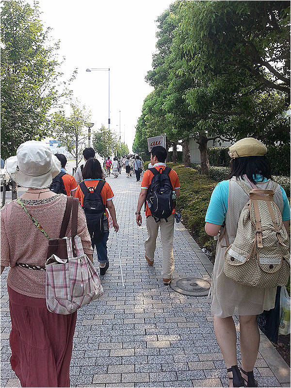
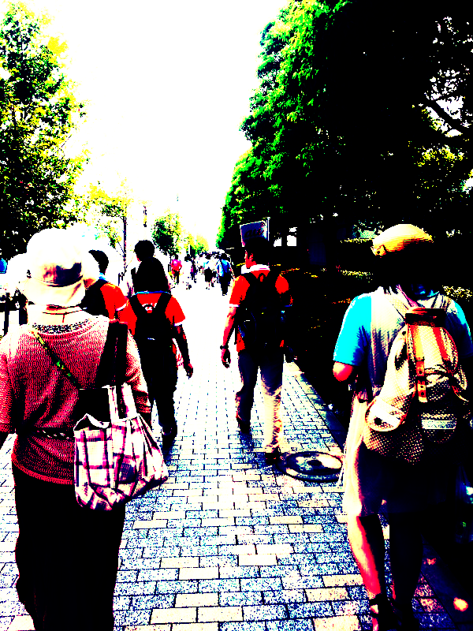
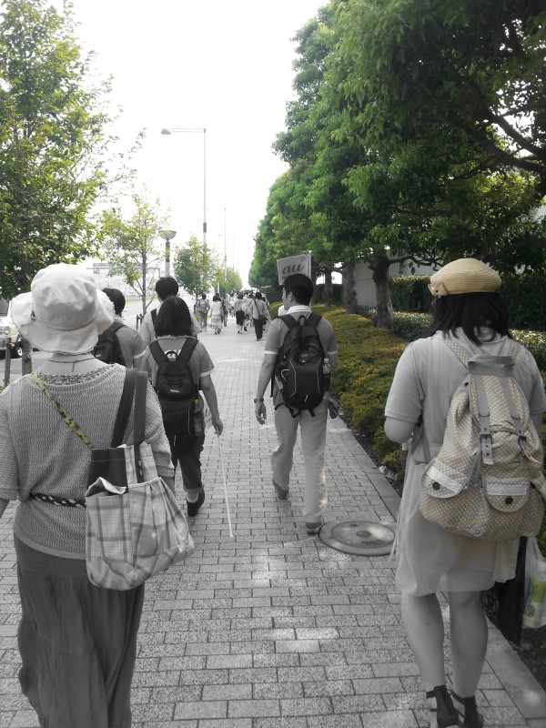

# filters-js

filters の js 版です

https://tanjo.xyz/filters-js

## Result

### 元画像

### グレースケール

### エンボス

### シャープ

### ネガティブ

### コントラスト強調・コントラスト減少

### ガウシアンフィルタ

### ソーベルフィルタ

### ラプラシアンフィルタ

### モザイク

### モザイク（強）

### 二値化

### Pタイル法

### フィルター1・2・3・4・5・6

### ポスタリゼーション

### メディアンフィルタ

### 絵画風

### FIRフィルタ

### ガンマ補正

### 赤・緑・青

### シンプル

## TODO

- ミニチュア風
- 2枚使って 9 : 1 合成
